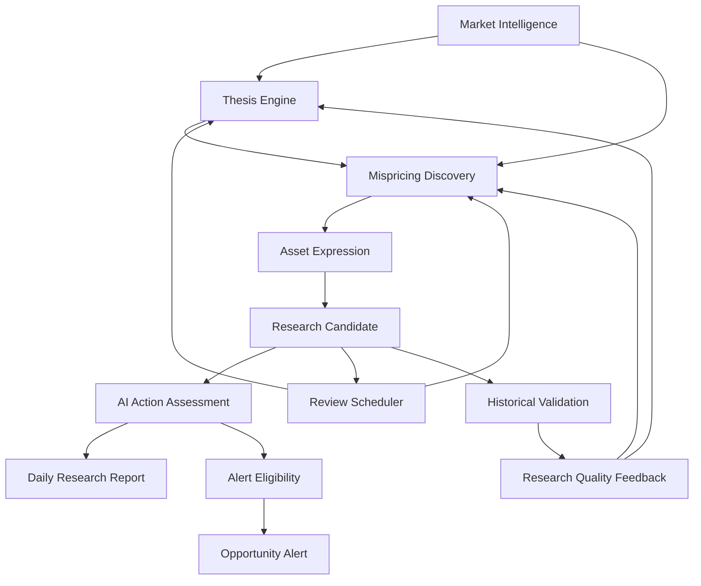

# AI Investment Researcher 目标架构 V2

版本：V2.0  
状态：目标设计，不修改当前代码

## 1. 架构结论

Vibe-Trading当前是一个以Agent、工具、渠道、回测、实盘和Value Hunter共同组成的模块化单体。它的技术能力较多，但产品主链路仍是“采集股票数据—计算分数—超过阈值—发送通知”。

V2不应立即重写整个项目，也不应马上拆成微服务。正确路径是：

> 先建立以Thesis和Mispricing Opportunity为核心的模块化单体，让所有数据、AI、回测和通知围绕同一研究生命周期工作；只有实际负载证明需要时，再拆分独立Worker或服务。

## 2. V2产品架构



系统围绕Opportunity运行，而不是围绕股票运行。Asset是某个Thesis与Opportunity的表达方式，Research Candidate是研究资源分配结果，Action Level是AI研究判断，不是交易命令。

## 3. 逻辑分层

### 3.1 Evidence & Data Plane

职责：

- 采集行情、估值、财务、公告、行业、指数/ETF成分和市场宽度；
- 保存原始数据、发布日期、系统获取时间和历史修订；
- 标准化Asset、市场和行业标识；
- 构建严格point-in-time数据视图；
- 管理Evidence、EvidenceSet、冲突和新鲜度。

原则：

- 批量摄取优先，逐股票API仅作补缺；
- 原始事实与AI解释分离；
- 数据缺失必须显式传播；
- 每次研究结论绑定不可变EvidenceSet。

### 3.2 Research Intelligence Plane

包含六个核心域：

1. `Market Intelligence`：形成MarketState及变化解释。
2. `Thesis Engine`：维护Thesis Tree、Version、Catalyst和Kill Criteria。
3. `Mispricing Discovery`：识别市场隐含预期与研究观点的偏离。
4. `Price Move Attribution`：解释为什么市场卖出及原因的持续性。
5. `Asset Expression`：比较股票、ETF、指数和行业的表达质量。
6. `Research Candidate`：形成研究优先级和开放问题。

### 3.3 AI Judgment Plane

职责：

- 归纳因果链；
- 识别支持和反对证据；
- 生成替代解释；
- 判断Temporary / Structural / Uncertain；
- 综合确定Action Level；
- 生成研究报告和变化摘要；
- 执行red-team审查。

边界：

- AI不负责事实存储、时间边界和通知门槛；
- AI不得修改历史ThesisVersion；
- AI判断必须绑定模型、Prompt、EvidenceSet和生成时间；
- Confidence只表示证据与判断稳健度；
- Action Level可由AI综合决定，但Opportunity Alert由确定性门槛控制。

### 3.4 Validation Plane

职责：

- 历史时点重放；
- Thesis和Evidence版本回放；
- Confidence校准；
- False Positive与Missed Opportunity分类；
- 过程质量和价格结果分开评价；
- 评估哪种能力真正提高Research Quality。

### 3.5 Delivery Plane

产品只有两个主要输出：

- `Daily Research Report`：每个A股交易日18:30生成；
- `Opportunity Alert`：满足固定高门槛时发送。

Web UI用于浏览Thesis、Opportunity、Candidate、Evidence和历史变化；飞书与邮箱是交付渠道，不承担研究逻辑。

### 3.6 Orchestration Plane

职责：

- 交易日历；
- 日终运行；
- Evidence更新触发；
- Review Date触发；
- 幂等、重试、运行记录和失败恢复；
- 每类任务资源预算。

Agent和Swarm可作为编排实现，但不是领域对象，也不应出现在产品主导航或核心指标中。

## 4. 目标模块结构

以下是逻辑结构，不是本阶段目录修改指令：

```text
investment_research/
├── constitution/
├── contracts/
├── assets/
├── evidence/
├── market_intelligence/
├── thesis/
├── mispricing/
├── asset_expression/
├── candidates/
├── action_assessment/
├── validation/
├── intelligence/
├── notifications/
├── orchestration/
├── repositories/
└── api/
```

依赖方向固定为：

```text
contracts ← domain modules ← application workflows ← adapters/API/UI
```

领域模块不得依赖FastAPI、飞书、SMTP、具体LLM SDK或具体数据供应商。

## 5. V1模块去留决策

### 5.1 保留并重新定位

| 当前能力 | V2角色 | 决策 |
|---|---|---|
| 数据Loader与缓存 | Evidence/Data Plane | 保留，统一时点和批量接口 |
| 因子库 | 内部特征来源 | 保留，不直接生成投资结论 |
| 回测引擎 | Historical Validation | 保留，补充研究结论回放 |
| API Server | Delivery/API Adapter | 保留，变薄 |
| React Web | 研究工作台 | 保留，围绕Thesis和Opportunity重组 |
| Scheduler | Orchestration | 保留，接入交易日历和Review触发 |
| 飞书/邮箱 | Delivery Adapter | 保留，改为独立投递状态 |
| Value Hunter历史数据 | V1迁移与基线 | 保留，只读兼容 |

### 5.2 重命名或替换语义

| V1名称 | V2名称 | 原因 |
|---|---|---|
| Value Hunter | AI Investment Researcher | 产品不只是“捡便宜” |
| Scanner / Scan | Discovery Engine / Discovery Run | 目标是发现与研究，而非机械扫描 |
| Candidate Score | Research Synthesis | 避免总分制造虚假精确度 |
| Market Score | Market State Evidence | 分数只是状态证据之一 |
| Candidate Result | Research Candidate | 表达研究资源分配 |
| Risk Flags | Counter Evidence / Kill Criteria Input | 风险需要证据和生命周期 |
| Notification Required | Alert Eligibility | 提醒条件必须可审计 |
| Watchlist CSV | Research Universe Policy | 不再固定为股票清单 |

### 5.3 降级为基础设施

| 能力 | V2地位 |
|---|---|
| Agent Loop | 可选研究编排器，不是产品核心 |
| MCP Server | 外部工具协议，不进入领域模型 |
| RAG | Evidence检索实现之一，有价值后再使用 |
| Swarm | 高成本研究任务的可选执行方式 |
| Plugin Framework | 未来扩展机制，不是首年目标 |
| 通用聊天 | 研究结果查询界面，不替代结构化研究流程 |

### 5.4 隔离或未来删除

- 自动下单、实盘订单与Action Candidate不得建立直接调用链；
- 与研究使命无关的交易频率和短线信号能力移出核心部署；
- 重复的CLI编排、巨型渠道逻辑和无领域价值的Agent包装，在V2.4迁移评审中决定拆除；
- 当前V1评分保留为对照基线，不继续扩展为更多打分项。

## 6. 核心应用流程

### 6.1 日终研究流程

```text
确认A股交易日与数据截止时间
→ 更新市场、资产、财务、公告和行业Evidence
→ 生成MarketState及变化
→ 更新受新Evidence影响的ThesisVersion
→ 发现Mispricing Hypotheses
→ 生成PriceMoveAttribution
→ 比较Asset Expressions
→ 创建/更新Research Candidates
→ AI生成ActionAssessment
→ 执行AlertEligibility
→ 18:30生成Daily Research Report
→ 必要时发送Opportunity Alert
→ 安排Next Review
```

### 6.2 Evidence更新流程

```text
新Evidence到达
→ 去重与时点校验
→ 关联Thesis/Opportunity/Asset
→ 判断是否Material
→ Material则触发Thesis或Candidate Review
→ 生成新Version/Assessment
→ 记录变化原因
```

### 6.3 历史验证流程

```text
选择历史日期
→ 仅加载当时可得Evidence
→ 重建MarketState与ThesisVersion
→ 执行Discovery和ActionAssessment
→ 锁定输出
→ 展开未来结果
→ 分别评价过程质量、校准和价格结果
```

## 7. 数据存储设计

### 7.1 事实存储

- 原始行情、财务、公告和行业数据采用版本化列式文件或对象存储；
- 保存provider、schema version、as-of和ingested_at；
- 禁止只保存最新覆盖值。

### 7.2 领域数据库

关系型数据库保存：

- Asset与有效期；
- Thesis、ThesisVersion和依赖；
- Evidence元数据和关系；
- Opportunity、Candidate和Assessment；
- Review、Outcome、Daily Report和DeliveryAttempt；
- 所有版本及审计字段。

首期本地模式可继续SQLite，但schema按未来PostgreSQL迁移设计，不在JSON payload中隐藏全部可查询字段。

### 7.3 AI产物

AI产物必须保存：

- 输入EvidenceSet hash；
- model identifier；
- prompt version；
- structured output；
- raw response引用；
-生成时间与成本；
- validation状态。

## 8. Research Quality指标

### 产品级

- 每日报告按时率；
- Evidence完整率和新鲜度；
- 候选压缩率；
- Research Candidate人工采纳率；
- Action Candidate稀缺度；
- Action Alert False Positive率；
- Thesis Review按时率；
- 结论可追溯率；
- 未解释价格变动占比。

### 研究级

- 反方证据覆盖率；
- Kill Criteria可验证率；
- Confidence校准误差；
- Temporary/Structural归因的事后准确性；
- 过程正确但结果亏损、过程错误但结果盈利的分类质量；
- Missed Opportunity复盘质量。

不使用“日报推荐数量”作为成功指标。

## 9. 可靠性与安全边界

- 日报生成失败和通知发送失败分别处理；
- 飞书、邮箱按渠道独立重试；
- 数据不全时照常生成日报，但必须披露缺口；
- AlertEligibility必须使用保存后的Assessment和EvidenceSet，避免生成过程中状态漂移；
- 所有外部凭证通过统一配置与秘密注入，不进入日志、报告或数据库正文；
- 同一交易日、相同输入和版本的Discovery Run必须幂等。

## 10. V2非功能目标

- 可解释：100%的Action Candidate可追溯；
- 可重放：任一历史报告可用相同输入重建；
- 克制：没有机会时产生明确空结果；
- 可扩展：Asset类型和市场适配不污染核心领域；
- 可测试：AI判断、通知门槛和历史时点分别验证；
- 可运营：运行状态、数据缺口、AI成本和通知状态可观测；
- 可演进：Thesis和Evidence历史不被覆盖。

## 11. 架构决策记录

V2实施阶段必须建立ADR，至少记录：

1. 为什么采用Thesis/Opportunity中心模型；
2. 为什么AI拥有Action Level最终研究判断；
3. 为什么Alert门槛保持确定性；
4. 为什么事实与解释分离；
5. 为什么首期只做A股科技；
6. 为什么暂不微服务化；
7. 为什么不直接复用V1总分。

