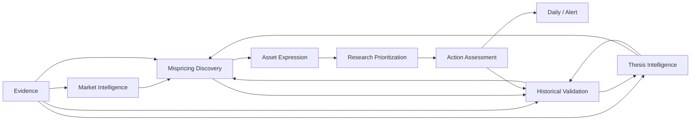

# AI Investment Researcher 产品能力设计 V2

版本：V2.1  
依据：项目宪法、领域模型、目标架构及Capability Matrix

## 1. 产品能力定义

产品能力不是页面、Agent或API。只有能够稳定改善研究决策的行为，才被定义为Capability。

每项能力必须拥有：

- 明确的研究问题；
- 输入和输出；
- Evidence要求；
- 用户价值；
- 历史验证方法；
- 失败时的降级行为；
- Research Quality指标。

## 2. L0能力地图

```text
AI Investment Researcher
├── Market Intelligence
├── Thesis Intelligence
├── Evidence Intelligence
├── Mispricing Discovery
├── Asset Expression
├── Research Prioritization
├── Action Assessment
├── Historical Validation
└── Intelligence Delivery
```

## 3. 核心能力目录

| ID | Capability | 回答的问题 | 主要输出 | 优先级 |
|---|---|---|---|---:|
| MKT-01 | Market State Classification | 当前是什么市场环境 | MarketState | P0 |
| MKT-02 | Market State Change | 今天与昨天哪里不同 | MarketStateTransition | P0 |
| MKT-03 | Stress Decomposition | 压力来自趋势、宽度、流动性还是估值 | Evidence-backed decomposition | P1 |
| THS-01 | Thesis Tree | 长期逻辑如何分层和传导 | Thesis graph | P0 |
| THS-02 | Thesis Versioning | 逻辑为什么增强或减弱 | ThesisVersion | P0 |
| THS-03 | Catalyst Tracking | 什么事件会验证逻辑 | Catalyst ledger | P1 |
| THS-04 | Kill Criteria | 什么事实会推翻逻辑 | Falsifiable criteria | P0 |
| THS-05 | Thesis Review | 哪些逻辑今天必须复核 | Review queue | P0 |
| EVD-01 | Evidence Ingestion | 有哪些当时可得事实 | Evidence | P0 |
| EVD-02 | Citation & Provenance | 事实来自哪里 | Source trace | P0 |
| EVD-03 | Counter Evidence | 最强反方证据是什么 | Counter-evidence view | P0 |
| EVD-04 | Freshness & Conflict | 信息是否陈旧或冲突 | Quality/freshness state | P0 |
| EVD-05 | Evidence Snapshot | 本次AI实际看到了什么 | EvidenceSet | P0 |
| OPP-01 | Market-Implied View | 当前价格隐含什么预期 | Implied expectation | P0 |
| OPP-02 | Price Move Attribution | 为什么市场卖出 | Attribution causes | P0 |
| OPP-03 | Permanence Analysis | 原因暂时还是结构性 | Temporary/Structural/Unknown | P0 |
| OPP-04 | Mispricing Hypothesis | 价格和价值哪里可能偏离 | MispricingOpportunity | P0 |
| OPP-05 | Convergence Path | 偏离可能如何收敛 | Catalyst/time path | P1 |
| AST-01 | Asset Exposure Mapping | 哪些资产真正暴露于Thesis | AssetExpression | P0 |
| AST-02 | Best Expression Comparison | 股票、ETF、行业谁表达更好 | Expression comparison | P1 |
| AST-03 | Idiosyncratic Risk | 单一资产额外承担什么风险 | Risk summary | P1 |
| RCH-01 | Candidate Compression | 几千资产中先研究谁 | ResearchCandidate set | P0 |
| RCH-02 | First Rejection | 最先应验证什么反对问题 | First rejection question | P0 |
| RCH-03 | Research Priority | 研究时间怎么分配 | Priority queue | P0 |
| ACT-01 | AI Action Assessment | 机会处于哪个行动观察阶段 | ActionAssessment | P0 |
| ACT-02 | Confidence Calibration | AI置信度是否可信 | Calibrated confidence | P1 |
| ACT-03 | Alert Eligibility | 是否达到稀缺提醒门槛 | Deterministic eligibility | P0 |
| VAL-01 | Point-in-Time Replay | 当时能否得到同样结论 | Historical replay | P0 |
| VAL-02 | Process vs Outcome | 研究正确还是碰巧赚钱 | OutcomeEvaluation | P0 |
| VAL-03 | False Positive Review | 为什么研究了垃圾机会 | Error classification | P0 |
| VAL-04 | Missed Opportunity Review | 为什么漏掉真正机会 | Recall review | P1 |
| DEL-01 | Daily Research Report | 今天研究上发生了什么 | Daily intelligence | P0 |
| DEL-02 | Opportunity Alert | 是否出现高门槛机会 | High-priority alert | P0 |
| DEL-03 | Change Feed | Thesis和候选怎样变化 | Versioned change feed | P1 |
| DEL-04 | Delivery Reliability | 用户是否真正收到 | Per-channel delivery state | P0 |

## 4. 能力依赖关系



关键约束：

- 没有Evidence，不建设Action Assessment；
- 没有Thesis Version，不建设Mispricing自动发现；
- 没有PIT Replay，不扩大到更多市场；
- 没有稳定Action Assessment，不建设组合或仓位能力。

## 5. 用户工作流

### 5.1 每日首屏

用户先看到：

1. Market State与变化；
2. Material Thesis Changes；
3. 新增/升级/降级的Research Candidates；
4. 当前Action Candidates；
5. Today Conclusion；
6. Next Reviews。

默认不显示全市场排名，也不把总分作为视觉中心。

### 5.2 候选研究页

阅读顺序：

```text
Why Now
→ Market-Implied View
→ Research View
→ Why the Market Is Selling
→ Temporary / Structural / Unknown
→ Supporting Evidence
→ Counter Evidence
→ Kill Criteria
→ Evidence Gaps
→ Action Level
→ Next Review
```

### 5.3 Thesis页

必须支持：

- 树状导航；
- 当前Version与历史Version对比；
- Confidence变化原因；
- 上下游影响；
- 最新支持/反对证据；
- Catalyst和Kill Criteria；
- 关联Opportunity和Asset Expression；
- Review队列。

## 6. AI与确定性能力分工

### AI负责

- Evidence解释；
- 因果链与替代解释；
- Thesis更新建议；
- Price Move Attribution；
- Temporary/Structural判断；
- Counter Evidence red-team；
- Research Priority；
- Action Level综合判断；
- 可读研究报告。

### 确定性系统负责

- 数据可得时间；
- Evidence去重与版本；
- Thesis历史不可变；
- 交易日历和调度；
- EvidenceSet快照；
- Alert固定门槛；
- 通知幂等与重试；
- 历史重放；
- 指标计算。

## 7. 最小产品切片

第一个可验证切片不做全市场，而做一条完整因果链：

```text
中国AI基础设施
→ AI CapEx
→ GPU / 光模块 / PCB / 服务器
→ 1个行业 + 1个ETF + 3—5家公司
→ Evidence更新
→ 1项Mispricing Hypothesis
→ Research Candidate
→ Daily Report
```

验证的是研究闭环，不是覆盖数量。

## 8. Capability准入规则

新能力只有同时满足以下要求才进入P0/P1：

1. 对北极星问题有直接贡献；
2. 有明确Evidence输入；
3. 有可审计输出；
4. 有历史验证方法；
5. 能定义False Positive；
6. 存在失败和无结果状态；
7. 没有更简单方案达到同样研究价值。

## 9. Not Now

- 自动交易与券商连接；
- 仓位优化；
- 日内信号；
- 强化学习策略；
- 通用多Agent团队；
- 大型向量数据库；
- 插件市场；
- 全市场实时流；
- 多租户和企业协作；
- 港美股数据实现；
- 由总分触发的荐股列表。

## 10. 能力成功指标

| 能力 | 首要指标 |
|---|---|
| Evidence | 来源可追溯率、PIT完整率、冲突发现率 |
| Thesis | Review按时率、Version变化可解释率、Kill Criteria可验证率 |
| Mispricing | 人工认可率、False Positive率、Unknown归因占比 |
| Candidate | 压缩率、研究采纳率、垃圾研究率 |
| Action Assessment | 等级稳定性、Confidence校准、降级响应时间 |
| Daily Report | 交易日按时率、空机会诚实率、变化信息密度 |
| Alert | 年度稀缺度、渠道投递率、事后研究质量 |
| Validation | 可重放率、前视偏差检测率、过程/结果分类一致性 |

“空机会诚实率”要求没有满足条件时明确输出零候选，不能因日报压力制造Research Candidate。

