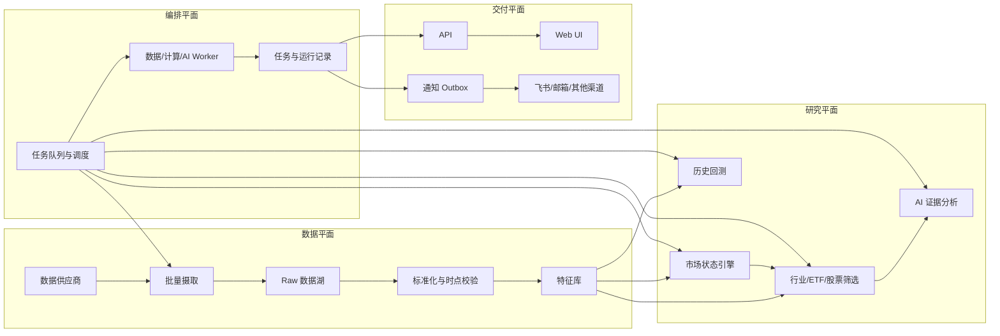

# Vibe-Trading 三年架构演进路线

## 1. 演进目标

目标不是立刻拆成大量微服务，而是在保持本地可运行和研发效率的基础上，使系统逐步支持：

- 1,000、5,000、10,000 只股票/ETF 的每日自动扫描；
- 市场状态、行业、龙头、估值、情绪和风险筛选；
- AI 公告与基本面分析；
- 严格时点数据的历史回测；
- 可扩展的数据、策略、评分、通知和插件生态；
- 可追踪、可复现、可恢复的任务执行。

核心原则：**先模块化单体，后按负载拆 worker；先批量数据，后做 AI；先保证时点正确，再追求模型复杂度。**

## 2. 目标架构



推荐维持四个逻辑平面：

1. **数据平面**：摄取、标准化、复权、时点可得性和特征。
2. **研究平面**：市场状态、评分、筛选、AI、回测。
3. **编排平面**：调度、队列、worker、幂等、重试和资源配额。
4. **交付平面**：API、前端、通知和审计。

早期它们可以仍在一个仓库甚至一个部署中，但依赖方向必须先固定。

## 3. 容量分级设计

| 规模 | 数据方式 | 计算方式 | 持久化 | 调度 | 合理部署 |
|---|---|---|---|---|---|
| 1,000 只 | 日终批量下载 | DuckDB/Polars 单机增量 | Parquet + SQLite | 单 scheduler + worker | 单机模块化单体 |
| 5,000 只 | 多供应商增量、分区数据湖 | 多进程 worker、共享特征 | Parquet/Object Storage + PostgreSQL | 持久队列、租约与重试 | API 与 worker 分离 |
| 10,000 只 | 多市场批次、版本化 raw 数据 | 分区并行、资源池隔离 | 对象存储 + PostgreSQL + 可选 Redis | 多队列、优先级和配额 | 横向扩展 worker |

不建议把逐股票实时 HTTP 请求扩大到任一档位。1,000 只股票开始就应使用批量 EOD 数据。

## 4. 第 0 阶段：0—3 个月，稳定现有边界

### 目标

让现有项目具备可靠继续演进的地基，不追求拆服务。

### 工作项

1. 修复中央配置门禁，Value Hunter 纳入 `src.config`。
2. 将已暴露的 Webhook、邮箱授权码和 Token 轮换，统一秘密注入和日志脱敏。
3. 通知建立 per-channel delivery record；飞书成功、邮箱失败时只重试邮箱。
4. 修复 Vite 开发代理缺少 `/value-hunter`。
5. 拆出 `AgentLoop` 的工具执行和上下文管理接口。
6. 冻结 `cli/_legacy.py`，禁止继续新增业务。
7. 消除 trading/live、swarm/tools、channels registry 的循环依赖。
8. 为所有扫描结果记录规则版本、配置 hash、数据日期和数据完整度。
9. 建立统一 `Run` 模型：queued/running/succeeded/partial/failed/cancelled。
10. 指标化 provider 延迟、缓存命中、扫描耗时、候选数和通知成功率。

### 交付标准

- CI 配置门禁通过；
- 同一次扫描可安全重跑且结果幂等；
- 通知失败可独立重试；
- 所有结论能追溯到数据时间和策略版本；
- 源码边界图不再出现核心循环。

## 5. 第 1 阶段：3—6 个月，支持 1,000 只股票

### 5.1 数据层

建立统一证券主数据：

- instrument：股票、ETF、指数；
- exchange/market；
- 上市、退市、停牌；
- 复权因子；
- 行业分类及生效区间；
- 指数/ETF 成分及生效区间；
- 财务报告发布日期和修订版本。

Raw 数据按 provider 原样保留；normalized 层统一字段和单位；point-in-time 层确保回测日期只能看到当时已公开数据。

建议文件布局：

```text
data/
  raw/{provider}/{dataset}/trade_date=YYYY-MM-DD/
  normalized/{dataset}/market=CN/trade_date=YYYY-MM-DD/
  features/{feature_set}/{version}/trade_date=YYYY-MM-DD/
```

### 5.2 扫描层

- 将 Value Hunter provider 拆为行情、估值、财务、公告和主数据接口。
- 一次拉取全市场批量数据，再做向量化评分。
- 市场状态先计算，未进入观察/恐慌阈值时仅做轻量更新。
- 股票、ETF、行业共用 `Instrument` 和 `Universe` 接口。
- 输出筛选漏斗：总池 → 数据完整 → 质量 → 估值 → 情绪/错杀 → AI 候选。

### 5.3 回测层

- Value Hunter 规则必须可在历史日期运行。
- 每次回测固定 universe、数据版本、规则版本和交易日历。
- 首先评估提醒质量：未来 1/3/6/12 个月收益、最大回撤、相对行业/指数超额，而不是模拟精确成交。

### 5.4 运行形态

仍可单机部署，但 API 只提交扫描任务，由独立 worker 进程执行。SQLite 管理本地元数据，Parquet + DuckDB 承担数据分析。

## 6. 第 2 阶段：6—12 个月，支持 5,000 只股票

### 6.1 持久任务平台

引入持久任务队列和 lease：

- 数据摄取队列；
- 特征计算队列；
- 筛选队列；
- AI 分析队列；
- 通知队列；
- 回测队列。

任务必须具备幂等 key、重试策略、超时、心跳、死信和可取消状态。API、scheduler 和 worker 分离部署。

### 6.2 存储升级

- PostgreSQL：证券主数据、任务、扫描索引、策略版本、通知状态、审计。
- Parquet/Object Storage：行情、财务快照、公告正文、特征和回测结果。
- Redis 可选：短期锁、限流、热状态；不作为唯一事实来源。
- DuckDB/Polars：交互分析和批量日频计算。

### 6.3 市场状态与行业

建立版本化 Market Regime Engine：

- 趋势：指数均线、回撤、波动率；
- 宽度：上涨家数、均线上方比例、新高新低；
- 流动性：成交额、换手、融资余额；
- 情绪：涨跌停、连板、风险偏好；
- 行业扩散：领涨行业数量和集中度。

行业和 ETF 不作为附加字段，而是一级实体：行业拥有成分历史、聚合财务、估值分位和相对强弱；ETF 拥有跟踪指数、费率、流动性、溢价和成分暴露。

### 6.4 AI 分析

AI 只接收规则筛选后的证据包：

- 财报变化；
- 现金流、应收、存货；
- 公告与处罚；
- 行业和竞争对手；
- 估值与历史区间；
- 支持与反对证据。

输出必须是结构化 schema，包含结论、证据引用、反例、置信度和信息截止时间。所有 prompt/model/version 可追溯并缓存。

## 7. 第 3 阶段：第 2 年，支持 10,000 只股票与成熟回测

### 7.1 计算扩展

- 按市场、交易日或 universe 分区并行；
- 共享基础特征 DAG，避免策略重复 rolling；
- 日终只计算新增分区；
- CPU 密集任务进入进程 worker；
- AI、网络和回测使用不同资源池；
- 设置完成 SLA，例如数据到齐后 60 分钟内完成 10,000 标的规则扫描。

### 7.2 历史回测平台

回测必须处理：

- 幸存者偏差；
- 财报发布日期而非报告期；
- 指数和行业成分历史；
- 停牌、涨跌停、退市；
- 复权和公司行动；
- 手续费、滑点和流动性；
- 数据修订和 look-ahead 检查。

支持两类评估：

1. 信号研究：候选后未来收益、回撤、命中率和校准度。
2. 组合回测：仓位、再平衡、交易约束和风险预算。

回测结果需要可复现 manifest：代码版本、数据版本、配置、随机种子、运行环境。

### 7.3 可观测与治理

- OpenTelemetry trace：scheduler → worker → provider → AI → notification；
- 数据质量指标：缺失、延迟、异常值、供应商差异；
- 模型指标：候选分布、置信度、漂移、成本和人工采纳率；
- 业务指标：预警次数、后续回撤、候选超额和误报率；
- 自动数据 lineage 和运行审计。

## 8. 第 4 阶段：第 3 年，插件平台与多市场

### 8.1 插件接口

适合插件化的能力：

| SPI | 作用 |
|---|---|
| `DataProvider` | 行情、财务、公告、主数据 |
| `UniverseProvider` | 股票池、指数、ETF、行业成分 |
| `FeaturePlugin` | 独立特征和依赖声明 |
| `MarketRegimePlugin` | 市场状态模型 |
| `ScoringPlugin` | 质量、估值、情绪、错杀评分 |
| `RiskRulePlugin` | 排雷与否决规则 |
| `AIAnalyzerPlugin` | 公告、财报、新闻解释 |
| `BacktestEnginePlugin` | 信号或组合回测 |
| `NotificationPlugin` | 飞书、邮箱、Slack 等 |
| `RepositoryPlugin` | 本地与服务化存储实现 |

插件 manifest 至少声明：名称、语义版本、兼容 API、配置 schema、输入/输出 schema、权限、资源预算和迁移要求。

### 8.2 插件隔离

- 可信轻量插件可进程内运行；
- 网络、第三方 SDK 和高 CPU 插件进入隔离 worker；
- 插件不能直接读取全局环境变量或数据库；
- 通过 capability 注入数据、网络、秘密和日志；
- 设置超时、内存、并发和请求配额。

### 8.3 多市场扩展

Instrument、Calendar、Currency、CorporateAction 和 MarketRule 从一开始保持市场中立。A 股特有的涨跌停、T+1、停牌和行业分类作为 market adapter；美股、港股、ETF 不应通过大量 `if market == ...` 散落在核心逻辑中。

## 9. 模块拆分顺序

推荐按依赖风险而不是文件大小排序：

1. `contracts`：DTO、Protocol、错误类型、事件 schema。
2. `config`：统一配置、秘密引用和策略版本。
3. `data`：provider SPI、PIT schema、批量 ingestion。
4. `orchestration`：Run、Job、Queue、Worker、Lease。
5. `research`：market regime、universe、feature、scoring。
6. `ai_analysis`：证据包、结构化输出和引用。
7. `backtest`：PIT 数据、执行和指标分离。
8. `delivery`：API、SSE/WebSocket、notification outbox。
9. `plugins`：manifest、发现、兼容与隔离。

只有当某一模块负载或部署节奏确实独立时再拆服务。先通过包边界和测试形成模块化单体，可避免过早承担分布式事务和运维成本。

## 10. 三年里程碑

| 时间 | 核心能力 | 验收指标 |
|---|---|---|
| 0—3 月 | 边界治理、配置、可靠通知、统一运行模型 | CI 通过；扫描幂等；通知可重试；核心循环依赖清零 |
| 3—6 月 | 1,000 标的批量扫描、PIT 数据雏形 | 日终扫描稳定；无逐股主路径；结果可复现 |
| 6—12 月 | 5,000 标的、持久队列、行业/ETF、AI 证据包 | API/worker 分离；任务可恢复；AI 有引用和版本 |
| 第 2 年 | 10,000 标的、成熟回测、特征库和可观测 | 固定 SLA；无前视偏差；容量压测通过 |
| 第 3 年 | 插件生态、多市场、治理和隔离 | 第三方插件不改核心；多市场规则独立；版本兼容可控 |

## 11. 关键风险与避免方式

- **过早微服务化**：先包边界，后部署边界。
- **把 AI 当数据源**：AI 只能解释可追溯证据，不能补造缺失事实。
- **回测前视偏差**：所有财报、行业、成分和公告必须带可得时间。
- **数据源锁定**：normalized schema 与 provider 解耦，保留 raw 数据。
- **插件失控**：配置 schema、能力权限、资源配额和版本兼容必须先于开放生态。
- **规模先于质量**：若 1,000 标的的数据完整率和时点正确性未达标，不应直接扩大到 10,000。
- **通知等同投资指令**：输出维持“研究候选/风险提示”，保留证据、反例和失效条件。

## 12. 最终评级

| 维度 | 当前 | 三年目标 |
|---|---:|---:|
| 数据架构 | ★★☆☆☆ | ★★★★★ |
| 任务编排 | ★★☆☆☆ | ★★★★☆ |
| 研究与回测 | ★★★☆☆ | ★★★★★ |
| AI 可追溯性 | ★★☆☆☆ | ★★★★☆ |
| 插件化 | ★★★☆☆ | ★★★★★ |
| 多市场扩展 | ★★☆☆☆ | ★★★★☆ |
| 运维与可观测 | ★★☆☆☆ | ★★★★☆ |
| 综合 | **★★★☆☆** | **★★★★☆** |

三年后的合理目标不是构建庞大的全能平台，而是形成一个数据时点可信、批量计算高效、研究结果可复现、插件边界稳定的投研基础设施。达到这一点后，10,000 标的、AI 分析、ETF/行业和多通知渠道都将成为容量问题，而不再是架构阻塞。

