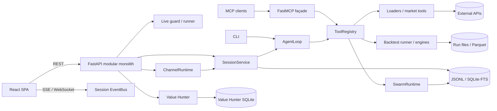
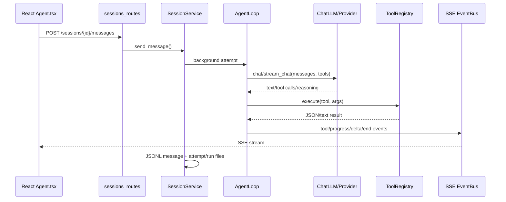
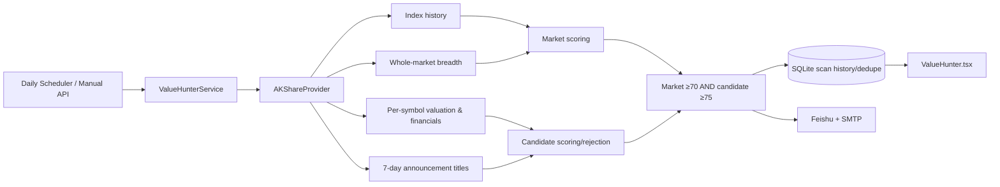

# Vibe-Trading 架构审查

> 审查日期：2026-07-20  
> 审查范围：`D:\AIStock\Vibe-Trading` 当前工作区，包括后端、前端、CLI、MCP、回测、渠道、Swarm、实时交易防护、Value Hunter、测试、部署与技能包。  
> 方法：目录盘点、入口追踪、Python AST 依赖分析、前端 import 分析、配置与部署文件检查。`node_modules`、`.git`、构建产物和二进制素材只统计用途，不做逐行审查。

## 1. 总体结论

项目是一个功能非常丰富的“模块化单体（modular monolith）”：一个 Python 进程同时承载 REST API、Agent 循环、MCP 工具、会话、渠道、定时任务、Swarm、回测、实时交易防护和 Value Hunter；React SPA 作为前端，通过 REST、SSE 和 WebSocket 与后端通信。

优点是功能覆盖面广、研究工具和数据源扩展能力强、安全边界意识较好；主要问题是进程内职责过多、多个插件体系各自实现、状态持久化方式碎片化、几个核心类和页面已经演化成 God Object。当前架构适合个人桌面研究和小规模并发，不适合直接扩展到 1,000–10,000 只股票的每日批处理平台。

## 2. 项目目录树

以下为架构视角的完整目录树。大规模同构目录（测试、因子、技能、图片）折叠并标注数量。

```text
Vibe-Trading/
├─ pyproject.toml                 # Python 包、CLI 入口、依赖与测试/覆盖配置
├─ requirements-lock.txt          # 依赖锁文件
├─ Dockerfile                     # 前端构建 + Python builder + runtime 三阶段镜像
├─ docker-compose.yml             # 单体后端、可选前端开发服务、持久卷与安全限制
├─ README*.md                     # 多语言产品与使用文档
├─ AGENT_CONTRIBUTOR_GUIDE.md     # 贡献与高风险表面说明
├─ SECURITY.md                    # 安全策略
├─ .github/
│  ├─ workflows/test.yml          # Python 测试、覆盖、前端构建与测试
│  └─ ISSUE_TEMPLATE/             # Issue 模板
├─ tools/
│  ├─ ci_env_var_gate.py          # 中央配置访问门禁
│  ├─ ci_grep_gates.sh            # 源码安全/规范门禁
│  └─ test_ci_env_var_gate.py
├─ scripts/dev                    # 开发启动脚本
├─ assets/                        # README 图片、视频等二进制素材
├─ wiki/                          # 静态站点、教程、Alpha 文档、Value Hunter 文档
├─ frontend/
│  ├─ package.json                # React 19、Vite、Vitest、Zustand、ECharts
│  ├─ vite.config.ts              # 路由代理与产物分包
│  ├─ vitest.config.ts            # 前端测试与覆盖范围
│  ├─ public/                     # Logo、favicon
│  └─ src/
│     ├─ main.tsx                 # SPA 启动入口
│     ├─ router.tsx               # 页面路由与 lazy loading
│     ├─ pages/
│     │  ├─ Agent.tsx             # 会话、SSE、工具过程、Swarm 主交互页
│     │  ├─ AlphaZoo.tsx          # Alpha 浏览、比较、基准测试
│     │  ├─ RunDetail.tsx         # 回测运行详情
│     │  ├─ Settings.tsx          # LLM、数据源、渠道配置
│     │  ├─ Runtime.tsx           # 实时运行状态
│     │  ├─ Reports.tsx           # 报告列表
│     │  ├─ Compare.tsx           # 运行比较
│     │  ├─ Correlation.tsx       # 相关性分析
│     │  └─ ValueHunter.tsx       # A 股市场压力与科技候选页
│     ├─ components/
│     │  ├─ chat/                 # 消息、工具、思考、Swarm、Mandate UI
│     │  ├─ charts/               # K 线、权益、验证图表
│     │  ├─ settings/             # 设置子组件
│     │  ├─ layout/               # 导航与页面布局
│     │  └─ common/               # 通用组件
│     ├─ hooks/                   # SSE、主题等 Hooks
│     ├─ stores/agent.ts          # Zustand 会话/流式状态
│     ├─ lib/
│     │  ├─ api.ts                # 全部 REST API 与 DTO
│     │  ├─ apiAuth.ts            # API key / SSE ticket
│     │  ├─ swarmStatus.ts        # Swarm 状态归并
│     │  ├─ indicators.ts         # 前端指标计算
│     │  └─ formatters/utils/...  # 格式化和工具
│     ├─ types/                   # Agent 类型
│     ├─ i18n/                    # 多语言资源
│     └─ **/__tests__/            # 28 个前端测试文件
└─ agent/
   ├─ api_server.py               # FastAPI 组装、生命周期、静态 SPA
   ├─ mcp_server.py               # FastMCP 入口与约 50+ 个研究工具门面
   ├─ cli/
   │  ├─ main.py                  # CLI 入口
   │  ├─ _legacy.py               # 历史 CLI 功能总集
   │  ├─ commands/                # chat/goal/memory/session/show 等命令
   │  ├─ components/              # CLI 交互组件
   │  ├─ ui/                      # CLI 布局与输出
   │  └─ utils/                   # CLI 格式工具
   ├─ backtest/
   │  ├─ runner.py                # 配置校验、策略安全扫描、数据与引擎编排
   │  ├─ models.py                # 回测领域模型
   │  ├─ metrics.py               # 绩效指标
   │  ├─ validation.py            # Walk-forward/Bootstrap/Monte Carlo 等验证
   │  ├─ correlation.py           # 相关性分析
   │  ├─ benchmark.py             # 基准比较
   │  ├─ run_card.py              # 运行卡片
   │  ├─ engines/                 # 12 个市场/组合执行引擎
   │  ├─ loaders/                 # 31 个数据加载器、fallback registry 与缓存
   │  └─ optimizers/              # 风险平价、均值方差、分散化等优化器
   ├─ scripts/                    # 性能基准和维护脚本
   ├─ tests/                      # 274 个测试文件、3,245 个 Python 测试函数
   └─ src/
      ├─ agent/
      │  ├─ loop.py               # ReAct/工具循环、并发、压缩、超时、目标续跑
      │  ├─ context.py            # Prompt 与上下文构建
      │  ├─ tools.py              # BaseTool / ToolRegistry
      │  ├─ skills.py             # Skill 加载
      │  ├─ trace.py              # 运行轨迹
      │  ├─ progress.py           # 进度/心跳
      │  └─ memory.py             # 单次运行记忆
      ├─ api/
      │  ├─ *_routes.py           # runs/sessions/settings/channels/swarm/live/alpha 等路由
      │  ├─ security.py           # 鉴权、CORS、SSE ticket、loopback 防护
      │  ├─ helpers.py            # 路径、环境文件、SPA 辅助
      │  ├─ models.py             # API DTO
      │  └─ state.py              # Session/Channel 单例装配
      ├─ core/
      │  ├─ runner.py             # LLM 生成代码的沙箱子进程执行
      │  └─ state.py              # 运行状态
      ├─ config/
      │  ├─ env_schema.py         # 环境变量模型
      │  ├─ accessor.py           # 中央环境配置缓存入口
      │  ├─ schema.py             # Agent/MCP/Channel 配置模型
      │  ├─ loader.py             # JSON/覆盖配置合并
      │  └─ paths.py              # 运行目录
      ├─ providers/
      │  ├─ llm.py                # 多 LLM provider 构造与诊断
      │  ├─ chat.py               # 统一 ChatLLM 流式响应与工具调用解析
      │  ├─ content_filter.py     # 内容过滤归一
      │  └─ openai_codex.py       # Codex OAuth provider
      ├─ tools/                   # 54 个工具文件 + MCP 包装与动态注册
      ├─ skills/                  # 87 个金融技能包（文档/脚本/参考资料）
      ├─ factors/
      │  ├─ base.py               # 因子公共算子
      │  ├─ registry.py           # 因子注册
      │  ├─ bench_runner*.py      # 因子批量评测
      │  ├─ compare_runner.py     # 因子比较
      │  └─ zoo/                  # 461 个 Alpha/GTJA/QLib/Academic 实现
      ├─ session/
      │  ├─ service.py            # 会话运行编排
      │  ├─ store.py              # JSON/JSONL 会话持久化
      │  ├─ search.py             # SQLite FTS5 跨会话检索
      │  ├─ events.py             # SSE EventBus
      │  └─ models.py             # Session/Message/Attempt
      ├─ memory/persistent.py     # 跨会话持久记忆
      ├─ goal/                    # 研究目标模型、策略与存储
      ├─ hypotheses/              # 研究假设注册
      ├─ scheduled_research/      # 定时研究模型、JSON store、executor
      ├─ swarm/
      │  ├─ runtime.py            # DAG 分层编排与线程池执行
      │  ├─ worker.py             # 单 Agent worker 循环
      │  ├─ store.py              # 文件型 run/event 持久化
      │  ├─ task_store.py         # 任务文件持久化
      │  └─ presets/              # 30 个 YAML 团队预设
      ├─ channels/
      │  ├─ base.py               # 渠道抽象
      │  ├─ manager.py            # 16 个渠道生命周期和出站分发
      │  ├─ runtime.py            # 入站消息到 SessionService
      │  ├─ registry.py           # 内建与 entry-point 插件发现
      │  ├─ bus/                  # Async MessageBus
      │  ├─ pairing/              # 配对/白名单
      │  └─ feishu/telegram/...   # 16 个渠道适配器
      ├─ channelsui/              # 渠道 UI 辅助服务
      ├─ trading/
      │  ├─ service.py            # 统一 broker 调用门面
      │  ├─ profiles.py           # Connector profile 聚合
      │  ├─ types.py              # TradingProfile
      │  ├─ tap_forward.py        # TAP 转发
      │  └─ connectors/           # Alpaca/IBKR/Futu/OKX/... SDK 适配器
      ├─ live/
      │  ├─ order_guard.py        # 订单许可、mandate、报价、审计
      │  ├─ registry.py           # Live broker 工具包装
      │  ├─ mandate/              # 授权约束
      │  ├─ runtime/              # 调度、触发、runner、reconcile、jobstore
      │  ├─ audit.py              # 审计记录
      │  ├─ halt.py               # Kill switch
      │  └─ advisory/enforcement  # 决策建议与强制限制
      ├─ strategy_store/          # SQLite 策略/因子/衰减存储
      ├─ shadow_account/          # 影子账户提取、回测、报告
      ├─ security/                # 网络、工作区和扫描安全
      ├─ value_hunter/
      │  ├─ service.py            # 扫描编排、阈值、去重、通知
      │  ├─ providers.py          # Demo/AKShare 数据、缓存、公告扫描
      │  ├─ scoring.py            # 市场/候选确定性评分
      │  ├─ models.py             # 观察、评分、扫描 DTO
      │  ├─ store.py              # SQLite 扫描历史与通知去重
      │  ├─ notifier.py           # 飞书 Webhook/SMTP
      │  ├─ scheduler.py          # 每日调度
      │  └─ config.py             # Value Hunter 环境配置
      └─ market_data.py           # 数据源检测与统一加载入口
```

## 3. 架构风格与边界

### 3.1 当前形态



这是“模块化单体 + 多适配器 + 文件/SQLite 混合持久化”。模块目录边界清楚，但运行时仍共享一个 Python 进程、全局单例、线程池与本地磁盘。

### 3.2 架构优点

- 数据加载器、渠道和工具都有 registry/Protocol/基类，具备插件雏形。
- Backtest engine 与 loader 基本解耦，可按市场规则替换。
- Agent 工具区分只读/写入，只读批次可并行。
- Live 交易有 mandate、kill switch、order guard、audit 多层防护。
- API 路由已从 `api_server.py` 拆分，主入口主要负责组装。
- 文件写入的部分关键路径（Swarm、Scheduled Research、loader cache）使用临时文件和原子替换。
- 测试数量多，安全和回归测试覆盖面广。

## 4. 模块职责与依赖关系

| 模块 | 主要职责 | 直接依赖 | 主要调用方 |
|---|---|---|---|
| `api_server.py` | FastAPI 组装、生命周期、SPA 静态服务 | `src.api.*`、preflight、scheduler、channels | CLI `serve`、Docker |
| `src.api.*` | REST/SSE 路由、鉴权、DTO、状态装配 | Session、Swarm、Live、Alpha、Config、Value Hunter | React、外部 API 客户端 |
| `mcp_server.py` | MCP 工具门面、JSON envelope | ToolRegistry、Goal、MarketData、Swarm | Claude/Cursor/OpenClaw 等 MCP 客户端 |
| `cli.*` | 本地交互、命令解析、服务启动 | Agent、Config、Session、Backtest、Swarm | 终端用户 |
| `src.agent.loop` | LLM 迭代、工具调用、并发、超时、上下文压缩、目标续跑 | ChatLLM、ToolRegistry、Goal、Trace、Memory、Config | SessionService、CLI |
| `src.providers.*` | LLM 构造、流式解析、provider 兼容 | LangChain、EnvConfig | AgentLoop、Swarm worker |
| `src.tools.*` | 研究能力与 MCP 包装 | 数据加载器、Backtest、Goal、Swarm、Trading | AgentLoop、MCP Server |
| `backtest.loaders.*` | 多市场数据读取、fallback、重试、Parquet 缓存 | 外部 API、Pandas、DuckDB | MarketData、Backtest、工具 |
| `backtest.engines.*` | 市场规则、撮合、费用、仓位/PnL | Pandas、模型、market hooks | Backtest runner |
| `backtest.runner` | 配置/代码安全校验、取数、引擎编排、输出 | loader registry、engines、Pydantic | BacktestTool、CLI、Swarm |
| `src.factors.*` | 因子注册、计算、评测、比较 | Pandas/Numpy、Backtest 数据 | Alpha API、Alpha tools |
| `src.session.*` | 会话、消息、attempt、SSE、跨会话搜索 | AgentLoop、文件系统、SQLite FTS | API、ChannelRuntime |
| `src.channels.*` | 各 IM/邮件/WebSocket 的收发与生命周期 | MessageBus、Session、第三方 SDK | API startup、Channel API |
| `src.swarm.*` | DAG 分层、多 Agent 并发、重试、事件与持久化 | Agent worker、Tools、Config、文件系统 | API、MCP、SwarmTool |
| `src.trading.*` | Broker profile 和统一读写门面 | Connector SDK、Config | Live、Trading tool、API |
| `src.live.*` | 实盘授权、限制、审计、调度、熔断 | Trading、Config、MCP wrappers | Live API、Agent tools |
| `src.scheduled_research.*` | 定时研究任务与执行 | JSON store、Session dispatch | API startup、Scheduled routes |
| `src.strategy_store.*` | 策略/因子/衰减记录 | SQLite、models | Alpha/SDM tools |
| `src.shadow_account.*` | 交易规则提取、影子回测、报告 | Backtest、模板、文件系统 | Shadow tools/API |
| `src.value_hunter.*` | A 股市场压力、科技候选、公告风险、提醒 | AKShare、SQLite、SMTP/Webhook | API startup、Value Hunter 页面 |
| `frontend/src/lib/api.ts` | 前端所有 REST DTO 与请求 | Fetch、apiAuth | 几乎所有页面 |
| `frontend/pages/Agent.tsx` | 会话交互、SSE、工具/Swarm UI | api、store、hooks、chat components | `/agent` 页面 |

## 5. 依赖关系分析

### 5.1 核心依赖方向

理想方向大致为：

```text
UI / CLI / MCP
    ↓
API / Session / Orchestrators
    ↓
Domain Services (Agent, Backtest, Swarm, Value Hunter, Live)
    ↓
Ports (Tool, Loader, Channel, Store, Broker)
    ↓
Adapters (AKShare, Feishu, SQLite, connector SDKs)
```

实际代码大体遵守，但以下地方发生反向依赖或横向互引：

- `src.tools` 在注册时导入 `src.live.registry`，Live 又依赖工具/MCP wrapper。
- `src.swarm.runtime/worker` 依赖 `src.tools`，`src.tools.swarm_tool` 又依赖 Swarm。
- `src.channels.manager/registry/__init__` 形成包级互引。
- CLI package、`cli.main` 和 `cli.commands` 互相 re-export。

AST 静态分析识别到 4 组循环：

1. `src.trading.service ↔ src.live.order_guard ↔ src.live.registry`
2. `src.swarm ↔ src.swarm.worker ↔ src.swarm.runtime ↔ src.tools.swarm_tool ↔ src.tools`
3. `src.channels ↔ src.channels.registry ↔ src.channels.manager`
4. `cli ↔ cli.main ↔ cli.commands`

这些循环目前大量依靠函数内延迟 import 和包级 re-export 缓解初始化问题，但增加了测试隔离和插件加载的不确定性。

### 5.2 高扇入模块

- `src.factors.base`：约 450 个因子实现依赖，是最大的公共基础面。
- `src.agent.tools`：61 个模块依赖，是工具抽象中心。
- `src.config.accessor`：53 个模块依赖，是正确的中央配置入口。
- `backtest.loaders.registry/base`：数据与回测的关键扩展点。
- `src.config.paths`：运行文件位置的全局契约。
- `src.channels.bus.events/queue`：渠道通信契约。

高扇入本身不是问题，但这些模块必须保持稳定、无副作用、强兼容和高测试覆盖。

### 5.3 高扇出模块

- `cli._legacy`：约 40 个内部模块依赖。
- `api_server`：约 21 个内部模块。
- `cli.main`：约 18 个内部模块。
- `mcp_server`：约 17 个内部模块。
- `backtest.runner`：约 16 个内部模块。
- `src.live.registry`：约 16 个内部模块。
- `AgentLoop`、`SwarmRuntime`、`TradingService` 也处于高扇出位置。

这些模块承担“组装根”职责时可接受，但 `cli._legacy`、`AgentLoop`、`SwarmRuntime` 已经不只是组装根，而是同时包含大量业务策略。

## 6. 数据流

### 6.1 Web Agent 对话



### 6.2 MCP 工具调用

```text
MCP client
→ mcp_server.py 的 @mcp.tool
→ lazy singleton ToolRegistry / GoalStore / MarketData
→ 本地 Tool 或外部 MCP wrapper
→ 数据源/回测/Swarm/文件 artifact
→ 标准 JSON envelope
```

`mcp_server.py` 是一个较厚的 façade，重复暴露了许多本地 Tool 能力。

### 6.3 回测数据流

```mermaid
flowchart LR
  Prompt[Agent/CLI/API config] --> BT[BacktestTool / runner]
  BT --> Validate[Config + AST safety validation]
  Validate --> Registry[LoaderRegistry]
  Registry --> Fallback[Market fallback chain]
  Fallback --> Cache[Parquet cache]
  Cache --> Panel[Pandas OHLCV/fundamental panel]
  Panel --> Engine[Market/Composite engine]
  Engine --> Metrics[metrics/validation/benchmark]
  Metrics --> Artifacts[(run JSON/CSV/HTML/PDF)]
  Artifacts --> UI[RunDetail/Reports]
```



### 6.4 Swarm 数据流

```text
Preset YAML + user variables
→ SwarmRuntime.start_run
→ grounding data prefetch
→ DAG topological layers
→ ThreadPoolExecutor(max_workers)
→ worker.run_worker → ChatLLM + filtered ToolRegistry
→ task JSON / events.jsonl / artifacts
→ aggregation task/final_report
→ REST/SSE/MCP consumer
```

### 6.5 渠道数据流

```text
Feishu/Telegram/Email/... inbound
→ BaseChannel adapter
→ MessageBus.inbound
→ ChannelRuntime
→ session mapping + SessionService.send_message
→ AgentLoop
→ MessageBus.outbound
→ ChannelManager fingerprint/dedup/routing
→ adapter.send
```

### 6.6 Live Trading 数据流

```text
UI/API authorization
→ mandate store + broker capability probe
→ LiveRunner trigger/reconcile
→ LiveOrderGuardTool
→ halt check + mandate limits + quote + advisory + daily count
→ TradingService / connector SDK
→ audit log + heartbeat + status API
```

### 6.7 Value Hunter 数据流



## 7. 调用关系

### 7.1 启动调用链

```text
vibe-trading serve
→ cli.main / serve command
→ api_server.serve_main
→ uvicorn.run(app)
→ FastAPI startup
   ├─ run_preflight
   ├─ start_scheduled_research_executor
   ├─ start_value_hunter
   └─ start_channel_runtime（按配置）
```

### 7.2 Agent 调用链

```text
SessionService._run_with_agent
→ build_llm / ChatLLM
→ build_registry
→ AgentLoop.run
→ ChatLLM.stream_chat
→ AgentLoop._process_tool_calls
→ parallel readonly / serial write
→ ToolRegistry.execute
→ trace + SSE + session persistence
```

### 7.3 Backtest 调用链

```text
BacktestTool.execute
→ subprocess / backtest.runner.main
→ BacktestConfigSchema
→ loader registry / fallback
→ signal engine import + safety scan
→ market engine
→ metrics + validation + run card
```

### 7.4 Value Hunter 调用链

```text
FastAPI startup
→ start_value_hunter
→ ValueHunterScheduler._loop
→ asyncio.to_thread(ValueHunterService.run)
→ provider.load_market/load_candidates
→ score_market/score_candidate
→ ValueHunterStore.save_scan
→ NotificationSender.send
```

## 8. 耦合过高的模块

| 模块 | 耦合问题 | 后果 | 严重度 |
|---|---|---|---|
| `src.agent.loop.AgentLoop` | 同时依赖 LLM、工具、目标、上下文、压缩、追踪、进度、内容过滤、线程与状态 | 任意一层变化都可能影响主循环；测试组合爆炸 | 高 |
| `src.swarm.runtime` + `worker` | 编排、重试、DAG、线程、持久化、grounding、LLM worker 强绑定 | 难替换队列/执行器，无法横向扩容 | 高 |
| `src.live.registry/order_guard/trading.service` | 工具注册、broker 判断、风控与 connector 形成循环 | 插件新增易触发 import 顺序问题 | 高 |
| `src.channels.manager` + 大型 adapter | 配置解释、生命周期、路由、dedupe、流式输出、平台协议混合 | 渠道功能无法统一演进，适配器复制严重 | 高 |
| `cli._legacy` | 5,484 行、40 个内部依赖 | 所有 CLI 改动风险集中，迁移困难 | 高 |
| `mcp_server.py` | 1,912 行函数式工具 façade，重复 ToolRegistry 能力 | 新工具可能需要多处暴露与同步 | 中高 |
| `frontend/pages/Agent.tsx` | 1,681 行，12 个 state、10 个 effect、18 个 callback | UI 状态机隐式，回归风险高 | 高 |
| `frontend/lib/api.ts` | 1,011 行，全部 API/DTO 集中 | 任意领域 API 改动都触及中心文件 | 中高 |
| `ValueHunterService` | 评分门槛、筛选、存储、通知策略都在 run 中编排 | 新 universe/策略/通知重试会继续膨胀 | 中 |

## 9. 违反单一职责的模块

### 明显违反

- `AgentLoop`：LLM 状态机、工具调度器、超时管理、上下文压缩器、目标续跑器、日志/追踪器。
- `cli/_legacy.py`：配置、命令、渠道、运行、展示和兼容逻辑的历史集合。
- `FeishuChannel`、`TelegramChannel`、`WeixinChannel`、`SignalChannel`：SDK 生命周期、鉴权、消息转换、媒体、流式发送、群聊策略、配对和错误处理集中在单个大型类。
- `SwarmRuntime`：DAG planner、scheduler、executor、retry policy、event publisher、run state writer。
- `Agent.tsx`：页面容器、会话控制器、SSE 状态机、消息投影、工具状态归并和 UI 渲染。
- `AlphaZoo.tsx`：目录、过滤、详情、benchmark、compare 和多路 SSE 混合。
- `api.ts`：传输层、错误模型、所有领域客户端与所有 DTO。

### 边界偏重但仍可接受

- `backtest.runner`：作为应用服务本应编排，但同时包含大量 AST 安全扫描与数据面板构造，应再拆分。
- `LiveOrderGuardTool`：风控门面合理，但 627 行类已经包含报价解析、意图规范化、审计与响应生成。
- `ValueHunterProvider`：数据适配器同时承担市场数据、财务、公告、缓存和降级策略。

## 10. 未来无法顺畅扩展的模块

### 10.1 Value Hunter 全市场扩展

当前是逐股票调用估值/财务 API，4 个线程；公告按最近 7 天逐日拉取全市场数据。14 只观察池首轮真实扫描曾耗时约 457 秒。扩展到 1,000–10,000 只股票时，当前模型在每日窗口内不可行。

### 10.2 Loader registry

Loader 使用 decorator 是好设计，但新增源仍需同时修改：

- `_loader_modules`
- `VALID_SOURCES`
- `FALLBACK_CHAINS`
- 可能还要改 backtest schema/tool 文档

测试可防漂移，却不是零修改插件。应转为 entry points + loader manifest/capability metadata。

### 10.3 Broker profile 聚合

`trading/profiles.py` 显式导入每个 connector 的 profile；`live/registry.py` 也显式导入每个 broker classification。新增 broker 需要改核心文件，违反开放封闭原则。

### 10.4 MCP façade

`mcp_server.py` 手工定义大量工具，即使本地 ToolRegistry 已存在。工具数量继续增长会放大 schema、文档与权限同步成本。

### 10.5 文件型状态

Session、Swarm、Scheduled Research、Goal、run artifacts 分别使用 JSON、JSONL、SQLite 或目录结构。个人使用足够；多 worker、多实例、远程部署时缺少统一事务、查询和租约语义。

### 10.6 前端中心文件

`Agent.tsx`、`AlphaZoo.tsx`、`api.ts` 已经成为扩展阻力。未来加入 10,000 股票筛选、行业、ETF、AI 分析和回测任务时，继续在页面内堆状态会迅速失控。

## 11. 适合插件化的模块

| 插件点 | 当前基础 | 建议 SPI |
|---|---|---|
| 数据源 | Loader protocol + decorator registry | `DataProviderPlugin` + capability/limit/cost/market manifest |
| 回测引擎 | `BaseEngine` + market engines | `ExecutionEnginePlugin` + fee/calendar/lot-size contract |
| 因子 | Factor registry + zoo | `FactorPlugin` + required fields + PIT contract + vectorization metadata |
| 工具 | `BaseTool` subclass discovery | Python entry point `vibe_trading.tools` + permission manifest |
| 渠道 | BaseChannel + entry points 已有雏形 | 标准 send/stream/media/capability/retry contract |
| Broker connector | 多 connector SDK，但核心显式导入 | `BrokerPlugin` + profile + classification + capabilities |
| Value Hunter universe | 固定观察池/CSV | `UniversePlugin`：A股、ETF、行业、港股、美股 |
| Value Hunter 评分 | 固定函数 | `ScoringPlugin`：质量、估值、成长、情绪、风险 |
| 市场状态 | 固定四维评分 | `MarketRegimePlugin`：趋势、宽度、流动性、波动、宏观 |
| AI 分析 | 尚未形成独立层 | `NarrativeAnalyzerPlugin`，输入证据包，输出结构化结论/引用 |
| 通知 | Value Hunter 内置 Feishu/SMTP；渠道系统另有实现 | 统一 `NotificationPlugin` + delivery receipt + per-channel retry |
| 持久化 | 多种独立 store | `Repository`/`EventStore` 接口，local/Postgres/object-store adapter |
| 调度 | Scheduled Research、Live、Value Hunter 各自实现 | 统一 Job/Trigger/Lease SPI |

## 12. 五星评级

| 维度 | 评级 | 评价 |
|---|---|---|
| 功能架构 | ★★★★☆ | 能力完整，研究、回测、Agent、渠道、Swarm 和实盘防护形成闭环 |
| 模块边界 | ★★★☆☆ | 目录清晰，但核心类、CLI 和前端页面边界已变厚 |
| 扩展性 | ★★★★☆ | Tool、Channel、Loader、Engine 已有插件雏形；Broker/调度/通知仍需核心改动 |
| 可维护性 | ★★★☆☆ | 测试多、类型较好，但巨型文件、循环依赖和重复适配逻辑明显 |
| 性能扩展 | ★★☆☆☆ | 适合个人/小池研究；全市场每日扫描与大规模 AI 分析需要数据平台化 |
| 可靠性 | ★★★★☆ | 安全、fallback、超时、原子写等设计成熟；状态存储和错误吞噬仍有风险 |
| 安全性 | ★★★★☆ | loopback、API key、SSE ticket、沙箱、live guard 很强；配置门禁已有新增违规 |
| 测试工程 | ★★★★☆ | 3,245 个 Python 测试函数和 28 个前端测试文件；覆盖率阈值未强制 |

**综合评级：★★★☆☆（3.5/5）**

项目已经是一套成熟的个人研究工作台，但还不是可横向扩容的数据与任务平台。下一阶段最重要的不是继续添加功能，而是统一插件契约、配置、调度、通知和持久化，并把 Agent/Swarm/渠道/前端巨型对象拆成可替换的应用服务。

